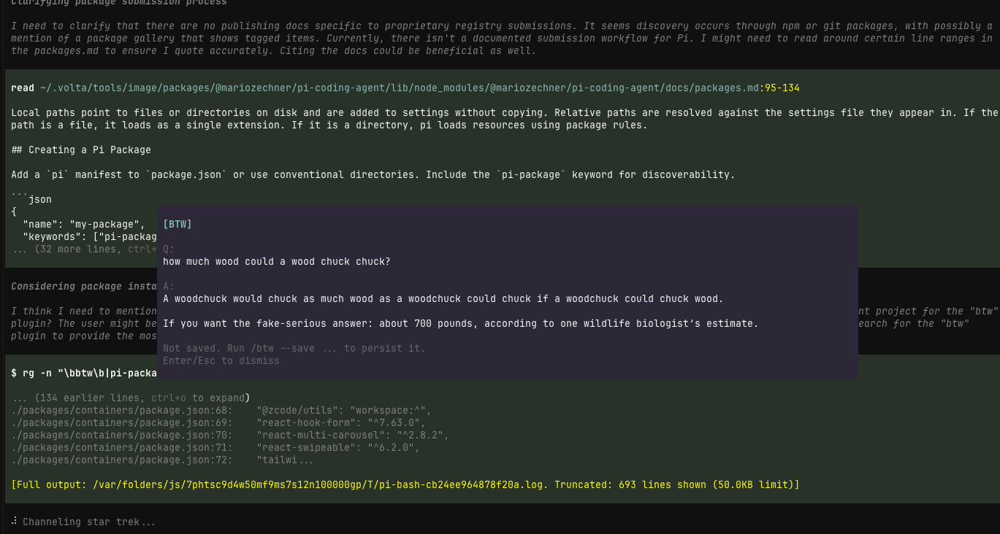

# pi-btw

A small [pi](https://github.com/badlogic/pi-mono) extension that adds a `/btw` side conversation channel.

`/btw` runs immediately, even while the main agent is still busy.



## What it does

- opens a parallel side conversation without interrupting the main run
- keeps a continuous BTW thread by default
- supports `/btw:tangent` for a contextless side thread that does not inherit the current main-session conversation
- streams answers into a widget above the editor
- keeps BTW thread entries out of the main agent's future context
- lets you inject the full thread, or a summary of it, back into the main agent
- optionally saves an individual BTW exchange as a visible session note with `--save`

## Install

### From npm (after publish)

```bash
pi install npm:pi-btw
```

### From git

```bash
pi install git:github.com/dbachelder/pi-btw
```

Then reload pi:

```text
/reload
```

### From a local checkout

```bash
pi install /absolute/path/to/pi-btw
```

## Usage

```text
/btw what file defines this route?
/btw how would you refactor this parser?
/btw --save summarize the last error in one sentence
/btw:new let's start a fresh thread about auth
/btw:tangent brainstorm from first principles without using the current chat context
/btw:inject implement the plan we just discussed
/btw:summarize turn that side thread into a short handoff
/btw:clear
```

## Commands

### `/btw [--save] <question>`

- runs right away
- works while pi is busy
- continues the current BTW thread
- streams into a widget above the editor
- persists the BTW exchange as hidden thread state
- with `--save`, also saves that single exchange as a visible session note

### `/btw:new [question]`

- clears the current BTW thread
- starts a fresh thread that still inherits the current main-session context
- optionally asks the first question in the new thread immediately

### `/btw:tangent [--save] <question>`

- starts or continues a contextless tangent thread
- does not inherit the current main-session conversation
- if you switch from `/btw` to `/btw:tangent` (or back), the previous side thread is cleared so the modes do not mix
- streams into the same above-editor widget
- with `--save`, also saves that single exchange as a visible session note

### `/btw:clear`

- dismisses the BTW widget
- clears the current BTW thread

### `/btw:inject [instructions]`

- sends the full BTW thread back to the main agent as a user message
- if pi is busy, queues it as a follow-up
- clears the BTW thread after sending

### `/btw:summarize [instructions]`

- summarizes the BTW thread with the current model
- injects the summary into the main agent
- if pi is busy, queues it as a follow-up
- clears the BTW thread after sending

## Behavior

### Hidden BTW thread state

BTW exchanges are persisted in the session as hidden custom entries so they:

- survive reloads and restarts
- rehydrate the BTW widget for the current branch
- preserve whether the current side thread is a normal `/btw` thread or a contextless `/btw:tangent`
- stay out of the main agent's LLM context

### Visible saved notes

If you use `--save`, that one BTW exchange is also written as a visible custom message in the session transcript.

## Why

Sometimes you want to:

- ask a clarifying question while the main agent keeps working
- think through next steps without derailing the current turn
- explore an idea, then inject it back once it's ready

## Included skill

This package also ships a small `btw` skill so pi can better recognize when a side-conversation workflow is appropriate.

It helps with discoverability and guidance, but it is not required for the extension itself to work.

## Development

The extension entrypoint is:

- `extensions/btw.ts`

The included skill is:

- `skills/btw/SKILL.md`

To use it without installing:

```bash
pi -e /path/to/pi-btw
```

## License

MIT
